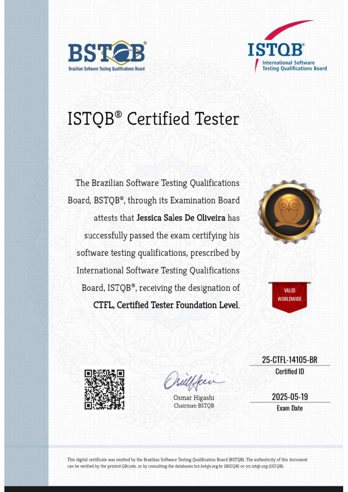

# 👋 Hello, I'm Jessica Sales Melo

### **QA Engineer** · Test Automation · End-to-End Software Quality
#### São Paulo, Brazil 🇧🇷

[-blue?logo=openbadges&logoColor=white)]()

---

## 👩‍💻 About me

I'm a **QA Engineer** with solid experience in **functional, integration, regression and end-to-end (E2E) testing**, working on **critical journeys for major clients** — from banking and financial services to e-commerce platforms and chatbot solutions.

My differentiator: **combining classic automation (Playwright, Cypress, Robot Framework, Rest Assured) with generative AI** (GitHub Copilot, Claude, Devin) to speed up test creation and maintenance — and I'm now **building frameworks that use AI to generate test cases automatically**.

---

## 🛠️ Stack & Skills

| Layer | Technologies |
|---|---|
| **E2E / UI Automation** |    |
| **API Testing** |    |
| **Performance** |   |
| **Cloud & Observability** |     |
| **Processes** |    |
| **AI in QA ✨** |    |

---

## 🚀 Featured projects

> **Automation that actually works — tested, documented and with green CI.**

<table>
  <tr>
    <td width="50%">
      <h3 align="center">🧪 swag-labs-playwright-bdd</h3>
      
<b>E2E Framework</b> — Playwright + TypeScript + playwright-bdd (Gherkin pt-BR) + Allure + GitHub Actions

      
Coverage: Login, Catalog and Checkout · 7 scenarios · Allure Report published on GH Pages

      

        <a href="https://github.com/jessicasalestech/swag-labs-playwright-bdd">🔗 View repository</a> ·
        <a href="https://jessicasalestech.github.io/swag-labs-playwright-bdd/">📊 Allure online</a>
      

    </td>
    <td width="50%">
      <h3 align="center">🤖 ai-test-generator</h3>
      
<b>AI in the test cycle</b> — describe a feature and the AI generates the Gherkin scenarios that run on Playwright

      
Plug-in AI provider (deterministic/OpenAI) · controlled glossary · green CI

      

        <a href="https://github.com/jessicasalestech/ai-test-generator">🔗 View repository</a>
      

    </td>
  </tr>
</table>

---

## 🎓 Education & Certifications

- 🏅 **ISTQB · Certified Tester Foundation Level (CTFL)** — *BSTQB · exam 19/05/2025 · ID 25-CTFL-14105-BR*

  

    
  

- 🎓 **Bachelor's in Computer Science** — Estácio *(in progress)*
- 🎓 **Postgraduate in Software Engineering** — Estácio
- 🎓 **Technologist in Systems Analysis and Development** — Universidade de Santo Amaro

---

## 📬 Let's connect

